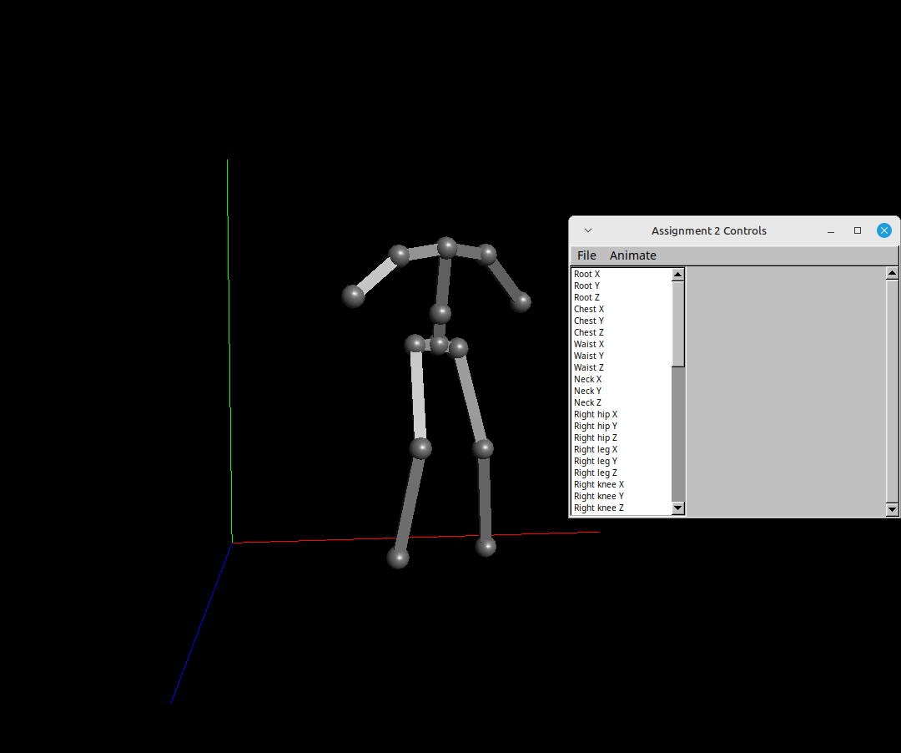
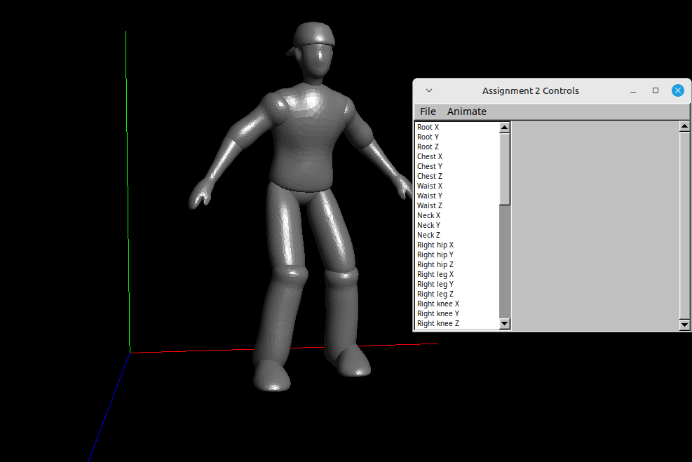
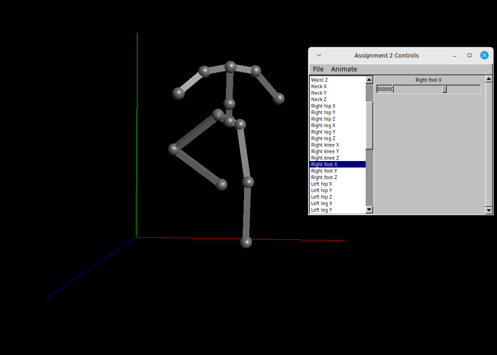
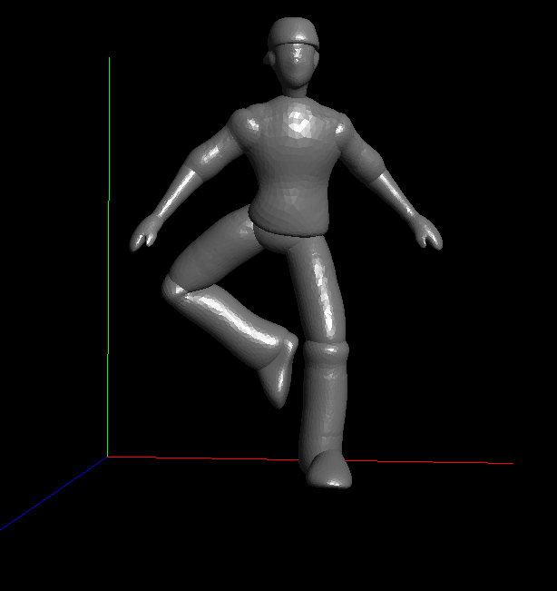

# Hierarchical Modeling & SSD | MIT

Este projeto foca na consolidação de Hierarchical Modeling, Forward Kinematics e Skeletal Subspace Deformation (SSD).

A matriz de transformação para cada objeto é definida por:
$$M_{model} = M_{parent} \cdot M_{local}$$

Para a computação de SSD, utiliza-se a seguinte formulação:
$$p'_{ij} = T_j \cdot p_i$$
$$p_{final} = \sum_{j} (w_{ij} \cdot p'_{ij})$$

Onde $p'_{ij}$ representa o vértice $i$ transformado pelo osso $j$, $T_j$ a matriz de transformação do osso $j$, $p_i$ a posição original do vértice $i$ e $w_{ij}$ o peso de influência da transformação do osso $j$ sobre o vértice $i$.

Abaixo estão os resultados visuais das implementações do projeto:

Projeto 2 (MIT): Visualização dos ossos - Interface inicial exibindo os controles de manipulação.

Projeto 2 (MIT): Visualização do modelo - Malha do modelo 3D carregado.

Projeto 2 (MIT): Transformações nos ossos - Aplicação de transformações geométricas à estrutura esquelética.

Projeto 2 (MIT): Modelo com SSD - Modelo 3D com deformação (SSD) aplicada com base na transformação dos ossos.